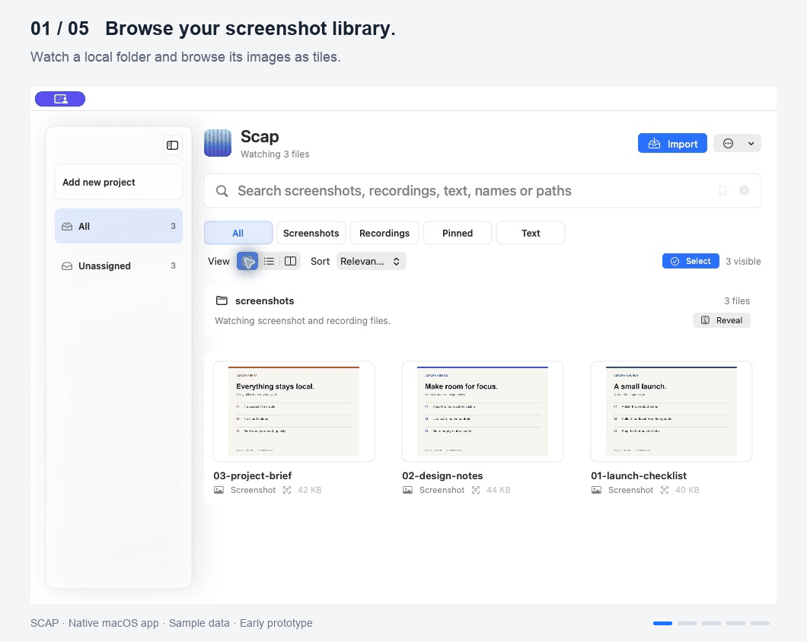
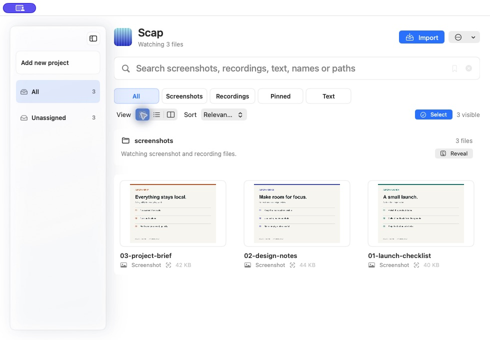
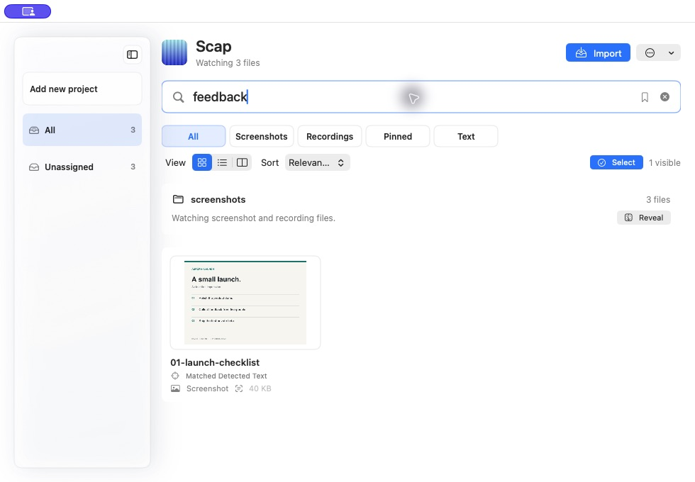
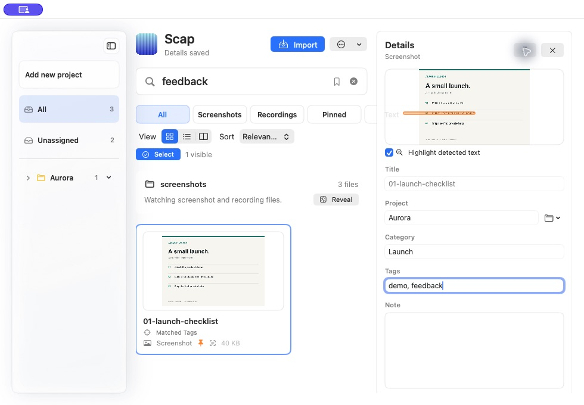
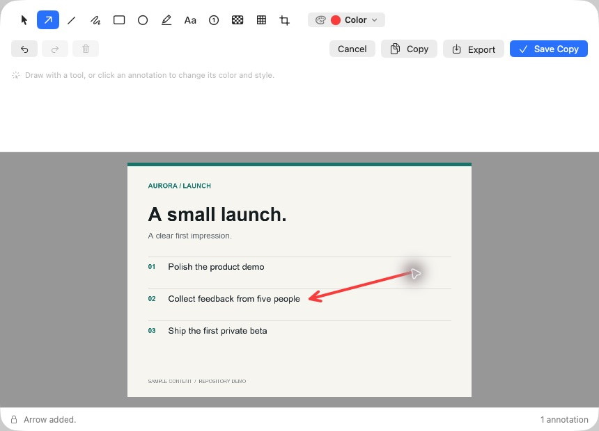
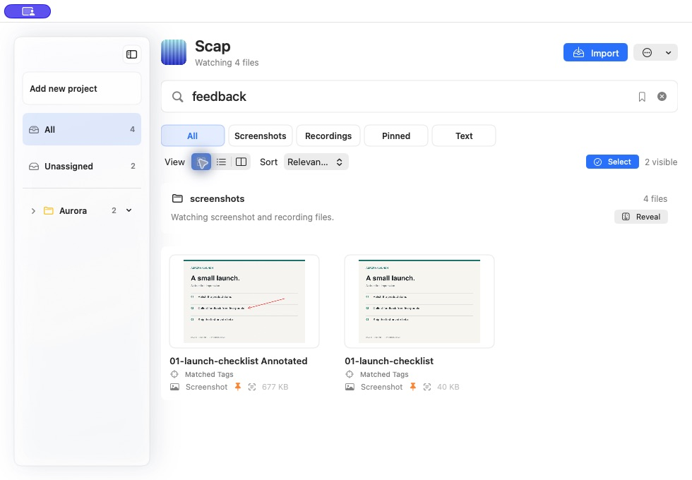

# Scap — visual walkthrough

Browse screenshots, search text inside images, organize your library and annotate a copy.

## 1. Browse a watched folder

Three sample images appear in the tile view of a local screenshot folder.

## 2. Find text inside an image

Searching for `feedback` finds the launch checklist through locally recognized text. The query is absent from the filename.

## 3. Add context

The checklist is assigned to Aurora, categorized as Launch, tagged and pinned.

## 4. Point out a detail

An arrow marks the feedback step in the annotation editor.

## 5. Preserve the original

Save Copy creates an annotated image alongside the original in the library.

## About these captures

Captured on 2026-09-14 from the native macOS app. Each GIF frame uses a real screenshot, with explanatory captions outside the app window. It is a step-by-step walkthrough, not a continuous screen recording.

Source snapshot: [`34e87ca`](https://github.com/testerwebu/scap/tree/34e87ca2b75d737365010b67a09023a05281098d).

All visible content is fictional sample data. The captures use a separate demo application identity and isolated settings. The selected folder contains only generated demo images; the system screenshot destination was not changed.

The production app source is unchanged by this documentation update. The repository README describes the current release status and limitations.
